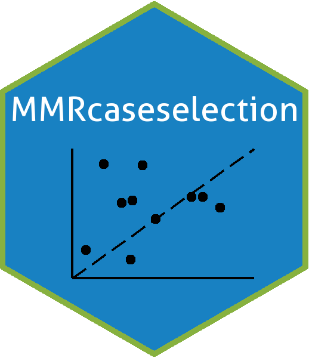

# MMRcaseselection 

[](https://www.repostatus.org/#active)

[](https://opensource.org/licenses/)


## Overview
Classification and choice of cases for case studies based on regression results.

**This is work in progress.** For now, the package contains functions for the classification of cases as typical, deviant, extreme or pathway cases and the choice of these types of cases. At this stage, the focus is on single cases and case selection based on linear regression models (class `lm`).

The package has not been submitted to CRAN yet. If you want to use it, please install it from Github. Any feedback is welcomed.
```r
devtools::install_github("ingorohlfing/MMRcaseselection")
```
The documentation of the package and examples can be found [here](https://ingorohlfing.github.io/MMRcaseselection/docs/).

***

Work on the package was funded by the European Research Council (ERC) under the European Union’s Horizon 2020 research and innovation program (grant agreement number 638425, *Enhanced Qualitative and Multimethod Research*).
