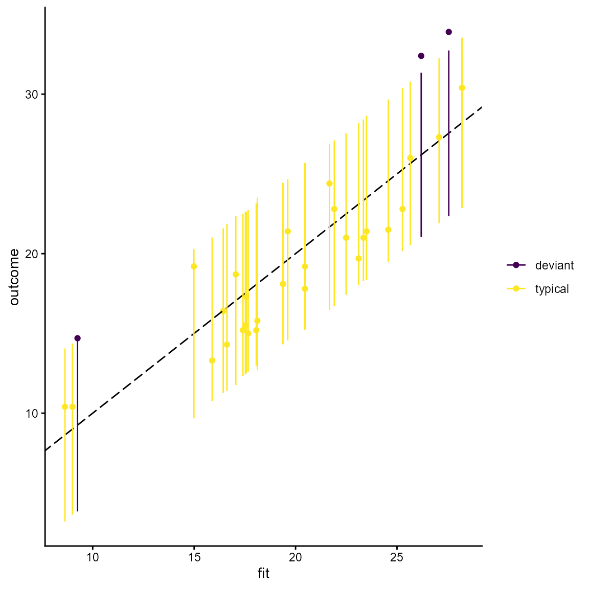
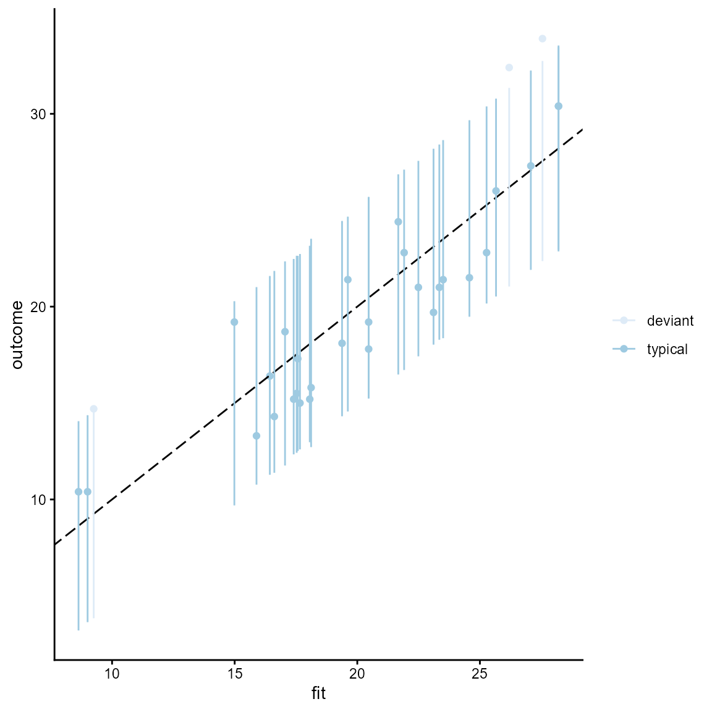
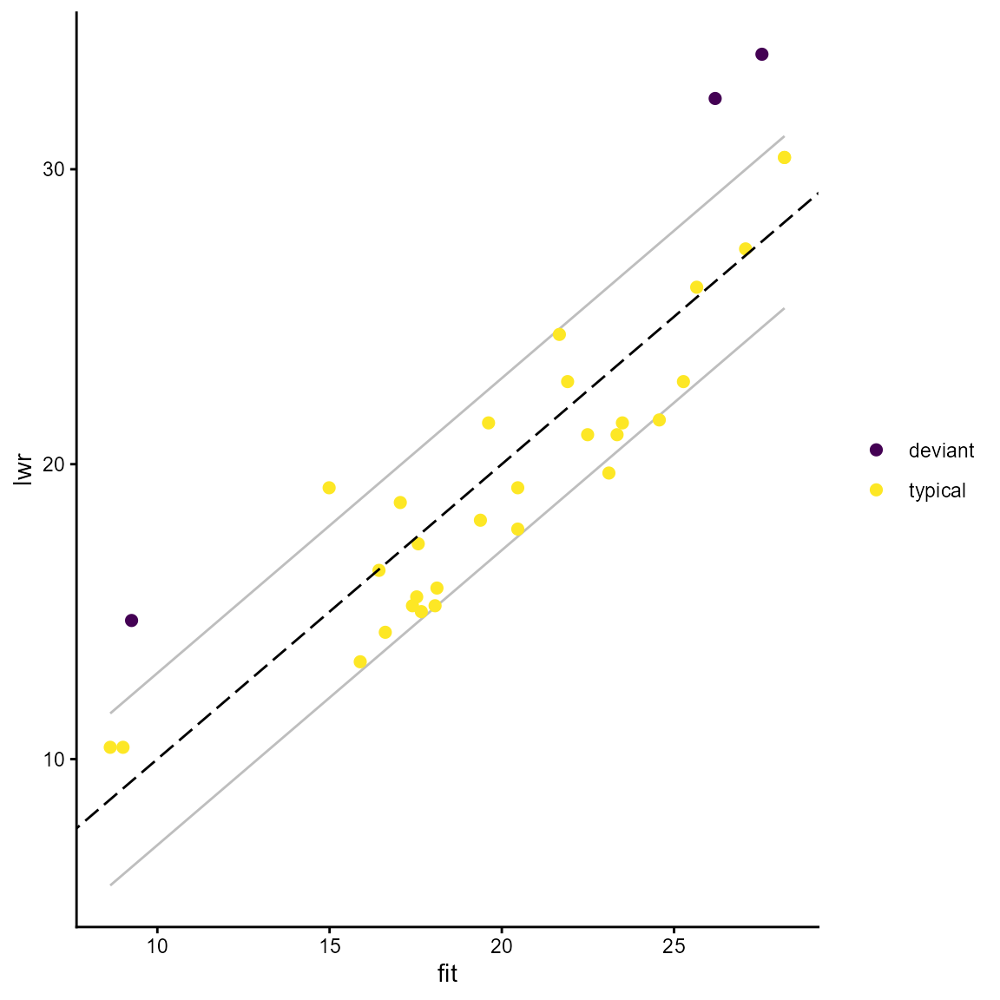

# Classification as typical and deviant

``` r

library(MMRcaseselection)
library(ggplot2) # for illustration of plot customization
#> Warning: package 'ggplot2' was built under R version 4.5.3
```

The classification (designation, assignment) of cases as typical and
deviant needs to be distinguished from the actual choice of cases that
are of a specific type. The package offers two ways of classifying
cases. First, one can designate cases using the *prediction interval* or
the *standard deviation of the residuals*. Both classification
techniques require an `lm` object as input.

The approach using the prediction interval additionally requires the
specification of the width of the interval. The % prediction interval
represents the range of outcome values within which 95% of future
outcome values are expected to fall in repeated samples. Following
Rohlfing and Starke ([2013](https://doi.org/10.1111/spsr.12052)), a case
is designated as typical if the observed outcome value is inside the
interval and as deviant otherwise.

Here is a simple example using the `mtcars` dataset and a 90% prediction
interval (for no specific reason, the default value is 0.95). The output
of the function is a dataframe with the observed and fitted outcome
values, the upper and lower bound of the prediction interval and the
case status based on the fitted value and the prediction interval that
is specific to each case.

``` r

df <- lm(mpg ~ disp + wt, data = mtcars)
pi_df <- predint(df, piwidth = 0.9)
head(pi_df)
#>                        fit      lwr      upr outcome  status
#> Mazda RX4         23.34543 18.28346 28.40741    21.0 typical
#> Mazda RX4 Wag     22.49097 17.42387 27.55808    21.0 typical
#> Datsun 710        25.27237 20.16282 30.38191    22.8 typical
#> Hornet 4 Drive    19.61467 14.56390 24.66543    21.4 typical
#> Hornet Sportabout 17.05281 11.75986 22.34575    18.7 typical
#> Valiant           19.37863 14.31502 24.44224    18.1 typical
```

The designation of cases based on the prediction interval can be
visualized with the
[`predint_plot()`](https://ingorohlfing.github.io/MMRcaseselection/reference/predint_plot.md)
command. The graph plots observed vs. fitted outcome values together
with the % prediction interval. The plot is a `gg` object and can be
edited with the usual commands of the `ggplot2` package.

The input into the plotting function has to be a dataframe produced with
[`predint()`](https://ingorohlfing.github.io/MMRcaseselection/reference/predint.md).
The color scheme is the [viridis color
palette](https://CRAN.R-project.org/package=viridis) that is accustomed
for colorblind readers and also works when printed in grey scale. If the
viridis palette is not preferred, one can substitute it with any other
`scale_color_*` scheme by adding it to the command.

``` r

predint_plot(pi_df)
```



``` r

# Using scale_color_brewer() instead of the viridis palette.
predint_plot(pi_df) + scale_color_brewer()
#> Scale for colour is already present.
#> Adding another scale for colour, which will replace the existing scale.
```



An alternative classification technique following Lieberman
([2005](https://doi.org/10.1017/S0003055405051762)) uses the *standard
deviation of the residuals*. The command for assigning cases and typical
and deviant is
[`residstd()`](https://ingorohlfing.github.io/MMRcaseselection/reference/residstd.md).
The specification of `stdshare` determines how large the share of the
residual standard deviation should be to distinguish typical from
deviant cases. The default value is 1 (for no specific reason).

``` r

resid_df <- residstd(df, stdshare = 1.5)
head(resid_df)
#>                        fit residual.scale outcome  status
#> Mazda RX4         23.34543       2.916555    21.0 typical
#> Mazda RX4 Wag     22.49097       2.916555    21.0 typical
#> Datsun 710        25.27237       2.916555    22.8 typical
#> Hornet 4 Drive    19.61467       2.916555    21.4 typical
#> Hornet Sportabout 17.05281       2.916555    18.7 typical
#> Valiant           19.37863       2.916555    18.1 typical
```

To my knowledge, it has not been proposed to plot the case
classification resulting from this technique. However, it can be done
and is available in this package with the command
[`residstd_plot()`](https://ingorohlfing.github.io/MMRcaseselection/reference/residstd_plot.md).
The standard deviation of the residual is necessarily the same for all
cases and is represented by a symmetric corridor (parallel grey lines)
around the bisecting line in a plot of observed vs. fitted outcome
values. The plot is a `gg` object that can be accustomed with `ggplot2`
commands.

``` r

residstd_plot(resid_df)
```



## Packages used in this vignette

- base (R Core Team 2020)
- ggplot2 (Wickham 2016)
- grateful (Rodriguez-Sanchez 2018)

R Core Team. 2020. *R: A Language and Environment for Statistical
Computing*. Vienna, Austria: R Foundation for Statistical Computing.
<https://www.R-project.org/>.

Rodriguez-Sanchez, Francisco. 2018. *grateful: Facilitate Citation of R
Packages*. <https://github.com/Pakillo/grateful>.

Wickham, Hadley. 2016. *ggplot2: Elegant Graphics for Data Analysis*.
Springer-Verlag New York. <https://ggplot2.tidyverse.org>.
