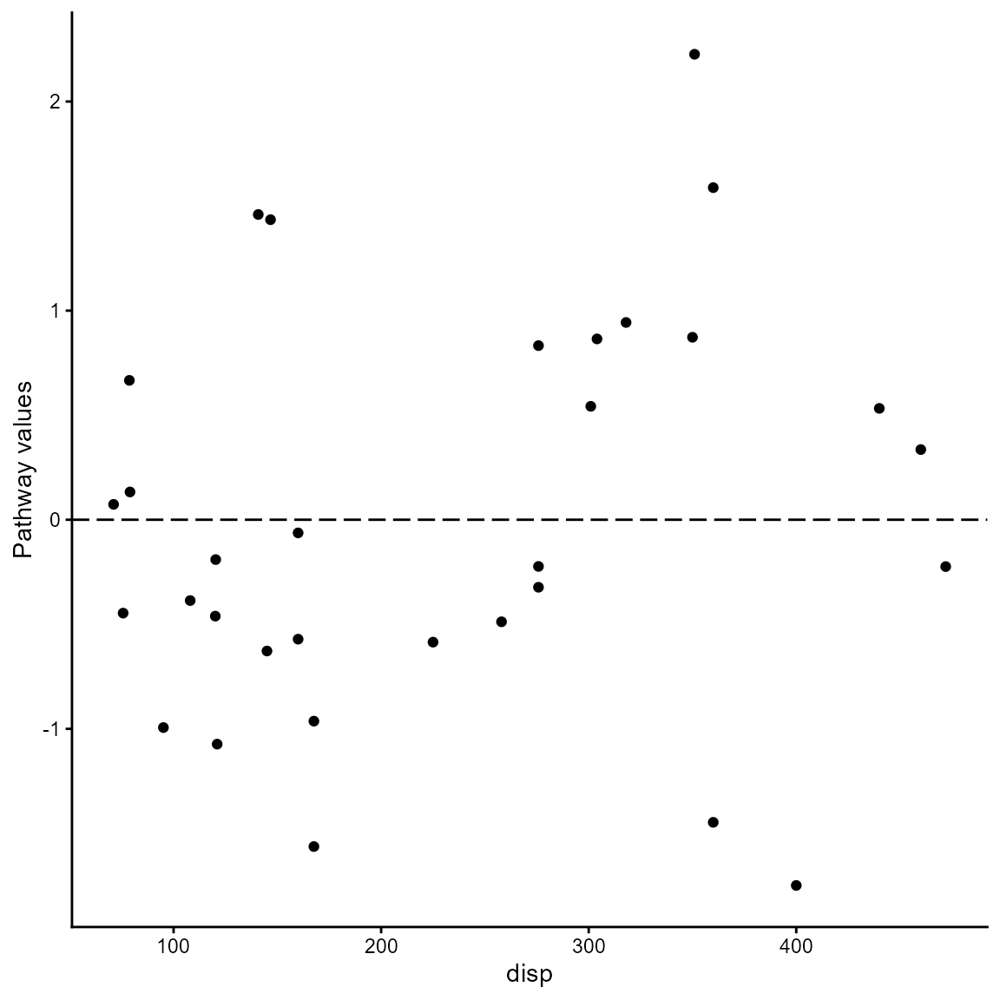
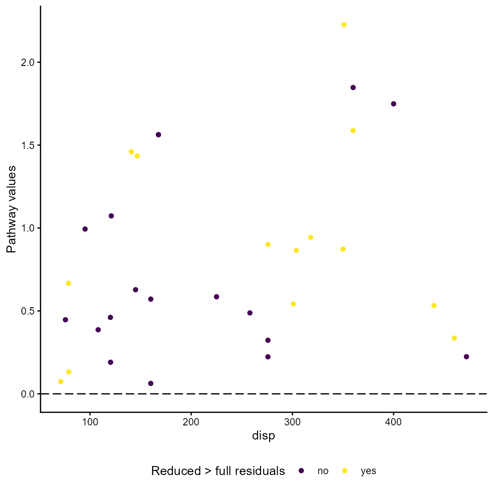

# Pathway case

``` r

library(MMRcaseselection)
```

The pathway was originally proposed by Gerring
([2007](https://doi.org/10.1177%2F0010414006290784)). He defines the
*pathway value* of a case as $`|resid_{i_{reduced}}-resid_{i_{full}}|`$
if it holds that $`|resid_{i_{reduced}}| > |resid_{i_{full}}|`$, where
‘full’ stands for the full regression model, ‘reduced’ for the model
that lacks the pathway variable of theoretical interest and $`i`$ being
a case index. Following Gerring, one should only choose among the cases
meeting the requirement that
$`|resid_{i_{reduced}}| > |resid_{i_{full}}|`$. In follow up research,
Weller and Barnes ([2014](https://doi.org/10.1017/CBO9781139644501))
propose a different calculation of the pathway value,
$`|resid_{i_{reduced}}|-|resid_{i_{full}}|`$, without specifying an
additional requirement about the relationship between the full model
residuals and reduced model residuals.

The function
[`pathway()`](https://ingorohlfing.github.io/MMRcaseselection/reference/pathway.md)
calculates both types of pathway values and requires the full regression
model and the reduced regression model as input. Both models must be
`lm` objects. The dataframe generated by the function contains all
variables from the full model plus the following variables:

- `full_resid`: Residuals in full model
- `reduced_resid`: Residuals in reduced model
- `pathway_wb`: Pathway values as proposed by Weller and Barnes
  ($`|resid_{i_{reduced}}|-|resid_{i_{full}}|`$)
- `pathway_gvalue`: Pathway values as proposed by Gerring
  ($`|resid_{i_{reduced}}-resid_{i_{full}}|`$)
- `pathway_gstatus`: Binary character variable that is coded “yes” if
  $`|resid_{reduced}| > |resid_{full}|`$ is met and “no” otherwise.

``` r

df_full <- lm(mpg ~ disp + wt, data = mtcars) # full model
df_reduced <- lm(mpg ~ wt, data = mtcars) # reduced model dropp 'disp' as pathway variable
pw_out <- pathway(df_full, df_reduced) # calculation of pathway variables
head(pw_out)
#>                    mpg disp    wt full_resid reduced_resid  pathway_wb
#> Mazda RX4         21.0  160 2.620  -2.345433    -2.2826106 -0.06282193
#> Mazda RX4 Wag     21.0  160 2.875  -1.490972    -0.9197704 -0.57120172
#> Datsun 710        22.8  108 2.320  -2.472367    -2.0859521 -0.38641476
#> Hornet 4 Drive    21.4  258 3.215   1.785333     1.2973499 -0.48798349
#> Hornet Sportabout 18.7  360 3.440   1.647193    -0.2001440 -1.44704909
#> Valiant           18.1  225 3.460  -1.278631    -0.6932545 -0.58537640
#>                   pathway_gvalue pathway_gtype
#> Mazda RX4             0.06282193            no
#> Mazda RX4 Wag         0.57120172            no
#> Datsun 710            0.38641476            no
#> Hornet 4 Drive        0.48798349            no
#> Hornet Sportabout     1.84733701            no
#> Valiant               0.58537640            no
```

The visualization of pathway values is different from the presentation
of ordinary residuals because two models are involved and an
observed-vs-fitted plot is not meaningful. Following the approach by
Weller and Barnes, the
[`pathway_xvr()`](https://ingorohlfing.github.io/MMRcaseselection/reference/pathway_xvr.md)
function plots the pathway values against the pathway variable. The
option `pathwaytype = "pathway_wb` produces a plot for the Weller/Barnes
values. The pathway variable is determined by the function and does not
have to be specified. The plot is a `gg` object that can be customized
with the usual `ggplot2` options.

``` r

pathway_xvr(df_full, df_reduced, pathway_type = "pathway_wb")
#> Warning: `aes_string()` was deprecated in ggplot2 3.0.0.
#> ℹ Please use tidy evaluation idioms with `aes()`.
#> ℹ See also `vignette("ggplot2-in-packages")` for more information.
#> ℹ The deprecated feature was likely used in the MMRcaseselection package.
#>   Please report the issue at
#>   <https://github.com/ingorohlfing/MMRcaseselection/issues>.
#> This warning is displayed once per session.
#> Call `lifecycle::last_lifecycle_warnings()` to see where this warning was
#> generated.
```



The Gerring pathway values are plotted against the pathway variable if
the option is \`pathway_type = “pathway_gvalue”. A color scheme is used
to distinguish the cases that meet the pathway case requirement (“yes”)
from those that don’t (“no”).

``` r

pathway_xvr(df_full, df_reduced, pathway_type = "pathway_gvalue")
```


